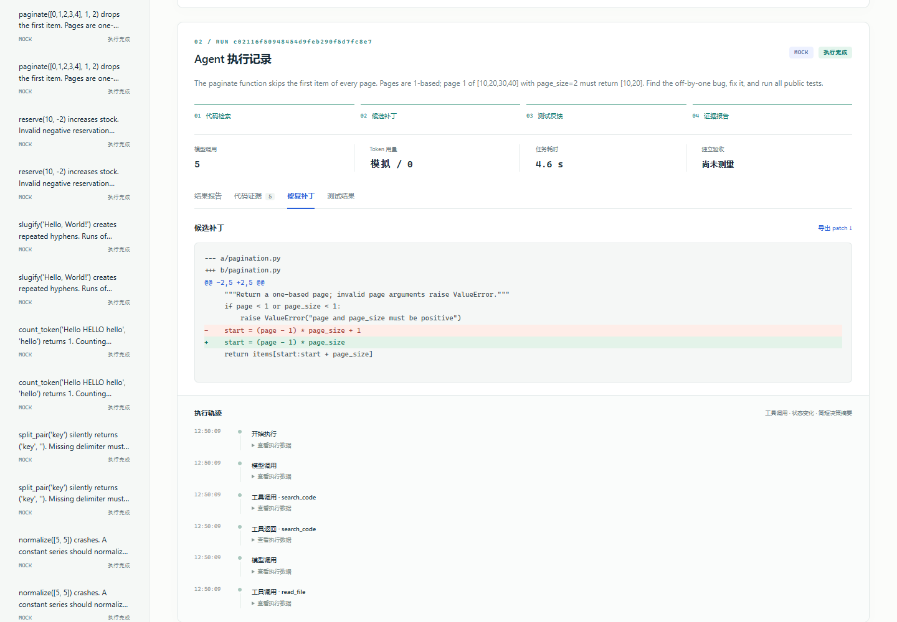
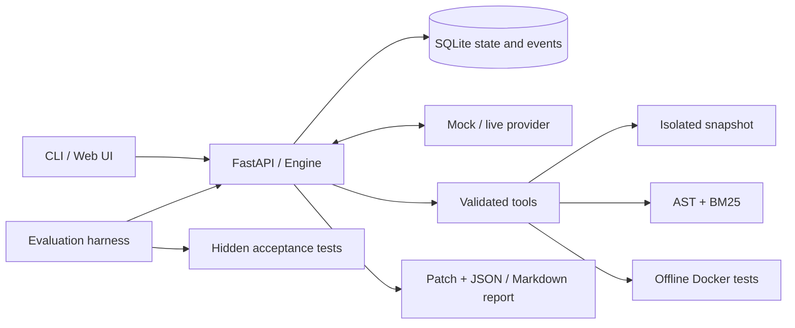

# RepoFix-Lab

[](https://github.com/qiaolezi001/repofix-lab/actions/workflows/ci.yml)

**Turn a Python issue into an evidence-backed candidate patch, then verify it in an offline Docker container.**

RepoFix-Lab is a small, inspectable agent engineering project: AST-based code retrieval, model-selected tools, test-feedback iteration, SQLite checkpoints, and reproducible evaluation. It targets small, dependency-free Python repositories and runs as a single-user local application.

> The default `mock` provider is a scripted pagination demonstration. It exercises real indexing, tools, persistence and reporting; it is **not evidence of model repair accuracy**. Real-provider end-to-end validation and repair benchmarks are **not yet measured**. See [validation status](STATUS.md).

Actual Docker verification now passes **10/10 engineering checks** on the maintainer's Windows/Linux engine and a [GitHub Linux runner](https://github.com/qiaolezi001/repofix-lab/actions/runs/37096982053). The checks include a real failing-to-passing patch, verification guards, inspected isolation limits, timeout/cancellation cleanup and a scripted Mock Agent run. Evidence is saved in `reports/docker-validation.json` and `reports/docker-local-validation.json`; these are not LLM benchmark scores. The application image is separately exercised in its documented diagnosis-only mode. See the [bounded live-validation guide (中文)](docs/live-validation.zh-CN.md).

[中文使用指南](docs/guide.zh-CN.md) · [Architecture](docs/architecture.md) · [Evaluation](docs/evaluation.md) · [Learning & interviews](docs/learning.zh-CN.md) · [Release checklist](docs/publishing.md)



*Actual local interface, scripted Mock mode. This screenshot demonstrates workflow, not real-model repair accuracy.*

## Quick start

Prerequisites: Python 3.11+ and [uv](https://docs.astral.sh/uv/getting-started/installation/). Run these commands from a source checkout:

```sh
uv sync --locked
uv run repofix doctor
uv run repofix demo
uv run repofix serve
```

Open [http://127.0.0.1:8765](http://127.0.0.1:8765), choose **载入示例**, then **启动修复**. The source contains an artificial pagination offset. The scripted provider retrieves code, applies an exact replacement and requests the full public test suite. Read the code evidence, patch, test result and execution trace; export Markdown or JSON.

Without Docker, the application still generates a candidate patch and report; public tests remain `unavailable`, and the task finishes as `completed`, never as a verified repair. To enable verification, use Docker with Linux containers and build the dedicated sandbox image:

```sh
docker build -f Dockerfile.sandbox -t repofix-sandbox:0.1 .
uv run repofix doctor
uv run repofix demo
```

Task test execution uses no network, a nonroot user, dropped capabilities, read-only source/root filesystem, a bounded temporary filesystem, CPU/memory/process limits and timeouts. User-submitted and model-generated task code is executed only in Docker. The development test suite validates trusted self-authored reference fixtures locally; that is dataset authoring validation, not an Agent score or Docker verification. Docker provides useful isolation, but this prototype is not a production security boundary against hostile code.

## Run your own issue

```sh
uv run repofix run ./examples/demo --issue "The paginate function skips the first item on page 1; fix the offset." --mode mock
```

`mock` only knows the bundled pagination fixture. For another repository, configure a real model through environment variables:

```text
REPOFIX_API_KEY=your-local-secret
REPOFIX_BASE_URL=https://api.openai.com/v1
REPOFIX_MODEL=your-tool-capable-model
```

The app reads process environment variables; it does not automatically load `.env`. Do not commit credentials or paste them into an Issue. See the [configuration guide](docs/guide.zh-CN.md#真实模型接入).

```sh
# Each command below explicitly authorizes paid API calls.
# Probe: 2 calls, up to 128 output tokens per call, cost unknown until provider pricing is supplied.
uv run repofix model-check --allow-paid
# Bounded repair: see configurable Limits and the live-mode confirmation in the UI.
uv run repofix run ./examples/demo --issue "Fix the pagination offset and run all public tests." --mode live --allow-paid
```

The adapter speaks Chat Completions function calling and validates the tool-result round trip. A compatible base URL is not sufficient by itself: the provider/model must support the request fields and function-call schema. Offline HTTP contract tests cover the adapter; no online success is claimed without a successful probe and live run.

## What is implemented

- Python AST symbol chunks, bounded syntax-error fallback, BM25 retrieval, exact file/line/version citations.
- Six typed tools: `list_files`, `search_code`, `read_file`, `apply_patch`, `run_tests`, `get_diff`.
- A bounded model/tool loop that consumes tool errors and test feedback; separate model, tool, repair, time and context budgets.
- SQLite state/events, cooperative cancellation, explicit restart recovery and patch receipts to avoid duplicate application.
- Isolated snapshots; traversal/symlink checks, immutable tests and baseline, exact-match edits with diff export.
- FastAPI + CLI + dependency-free HTML/CSS/JS interface; no CDN or JavaScript build step.
- Fifteen synthetic tasks across three small codebases, with a frozen development/evaluation split and hidden acceptance tests outside the agent workspace.

## Evaluation and validation

```sh
# Offline pipeline exercise; never interpret mock outcomes as model accuracy.
uv run repofix evaluate --mode mock --split eval --output work/mock-eval
# Paid comparison; use only after reviewing the call/token budgets in docs/evaluation.md.
uv run repofix evaluate --mode live --split eval --output work/live-eval --allow-paid

uv run ruff check .
uv run ruff format --check .
uv run mypy src/repofix
uv run pytest
```

Evaluation compares one-shot source-context patch generation against an iterative retrieval/tool strategy. Both use the same model, tasks and declared per-call output cap; call budgets differ and are recorded. Tokens, time and API cost are reported only when available. Reference solutions and hidden tests remain outside task inputs. See [evaluation methodology](docs/evaluation.md) for exact semantics and limitations.

Local checks and artifacts are listed in [STATUS.md](STATUS.md). Follow-up local checks pass 140 tests (2 explicit skips); the [Linux checks](https://github.com/qiaolezi001/repofix-lab/actions/runs/37096982058) pass 141 (1 opt-in Docker skip). The separate Docker workflow actually executes the containers and retains a JSON artifact. The badge links to current branch checks.

## Architecture



The v0.1 orchestration uses an explicit state machine rather than a graph framework: the loop is small, and checkpoint/side-effect boundaries are easier to read directly. [Design decisions and recovery](docs/architecture.md) explain the tradeoffs.

## Containers

The recommended verification setup is a **host Python application + Docker sandbox**. A separate app image is also available:

```sh
docker compose up --build
```

Open the same localhost URL. This container supports diagnosis/API/UI only, because it has no Docker socket or daemon access. It mounts the bundled demo read-only and persists task data in a named volume. Live credentials are not forwarded by default. Arbitrary host paths are not visible inside it; mount a chosen repository read-only and use its container path if needed.

## Boundaries and roadmap

This is an educational local tool, not a general repair service. The snapshot accepts UTF-8 `.py` and `.md`, up to 500 files, 256 KiB per file and 8 MiB total; infrastructure files, secret-like paths and answer directories are excluded. Repositories requiring `conftest.py`, dependency installation, compilation, network services or non-Python assets are outside v0.1. No new-file patches, remote repository ingestion, authentication or multi-process scheduling are implemented.

Next steps: live benchmark evidence, stronger adversarial evaluation, additional retrievers, dependency-aware sandbox images, and a reviewed multi-user security design. Changes should preserve the distinction between candidate generation, public verification and independent evaluation.

## Open source

All example code and artificial tasks were created for this project and use the [MIT License](LICENSE). Third-party dependencies retain their own licenses. See [CONTRIBUTING.md](CONTRIBUTING.md) and [publishing instructions](docs/publishing.md). Project generation was assisted by Codex; the [learning guide](docs/learning.zh-CN.md) distinguishes delivered work from what a human maintainer must understand and validate.
