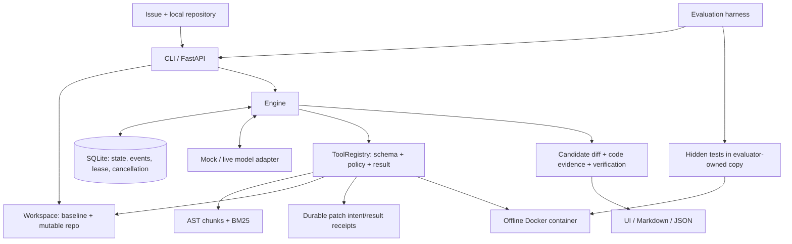
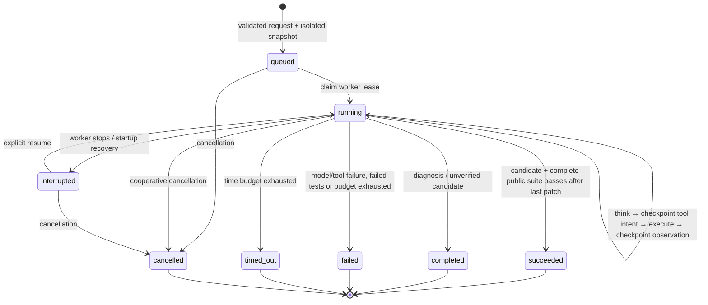

# Architecture and design decisions

RepoFix-Lab v0.1 is a single-process application for small, local Python repositories. Its trusted orchestration never imports or executes candidate code; candidate tests run in Docker only. The model selects validated tools, receives their observations and can revise a patch within fixed budgets.

## Components

| File | Responsibility |
| --- | --- |
| `models.py` | Strict Pydantic task limits/requests and provider reply types |
| `config.py` | Process configuration; credentials excluded from dataclass repr |
| `workspace.py` | Filtered snapshots, immutable manifest/baseline and path policy |
| `index.py` | AST passages, code coordinates, tokenization and BM25 |
| `tools.py` | Six typed tools, uniform errors, patch receipts and protected tests |
| `providers.py` | Transparent mock and real Chat Completions adapter |
| `store.py` | SQLite checkpoints, separate cancellation flag and worker lease |
| `engine.py` | Budgeted tool loop, cancellation/recovery and verification decisions |
| `sandbox.py` | Docker availability, command policy, bounded logs and container cleanup |
| `reports.py` | Exportable human/machine-readable evidence and outcomes |
| `api.py`, `cli.py` | Local entry points and task lifecycle |
| `static/` | Same-origin browser UI without build dependencies |
| `evaluation.py` | Separate public/hidden evaluation, fair configuration records |

## State machine

`phase` provides progress detail (`indexing`, `thinking`, `executing`, `verifying`, `done`); `status` governs lifecycle. Model calls, tool requests/results and finish events are stored with timestamps. Observations include structured errors so the model can adapt rather than having every tool failure terminate the task.

## Why an explicit state machine?

The v0.1 loop has a small number of transitions and one active tool action at a time. A direct loop exposes the point where intent is durable and side effects occur, keeps recovery auditable and removes an additional orchestration dependency. LangGraph would be useful for branching subagents and graph-level replay later; using it now would add abstraction without resolving a current requirement. The relevant skill here is durable orchestration, not framework usage by itself.

## Retrieval and evidence

Python AST produces function/class/nested-symbol passages and module-level statements. Long symbols split into at most 100-line passages, retaining real line numbers. Syntax errors fall back to bounded text with warnings. CamelCase and snake_case are split for lexical BM25 matching; a small character fallback handles Chinese tokens.

BM25 requires no embedding account, is deterministic, and is effective when an Issue includes names present in code. It misses semantic synonyms and may return overlapping class/method chunks. No-result retrieval is a valid tool result; the model can change query or read a known file. Every citation includes path, symbol, line range, baseline snapshot version and content hash; the hash distinguishes evidence before/after edits even when the baseline version remains the same.

The model does not receive hidden tests or answer metadata. `read_file` is limited to 200 lines; tool results are bounded. Context compaction retains system/Issue messages and the most recent complete assistant/tool rounds so that tool-call protocol pairs remain valid. The 32000-character default bounds serialized messages and tool schemas, not tokens. Model-specific transport fields are outside that context measure; `max_context_chars` records the largest actual serialized context. Model call counts are outbound attempts; missing or malformed token usage stays unknown.

## Tool boundary and patch recovery

Pydantic rejects unknown fields, coercion and invalid limits. Each tool returns `{ok, data, error}`; errors distinguish unknown tools, invalid arguments, policy/precondition failures and I/O failures. Paths must be accepted POSIX-relative paths, without drives, traversal or symlinks. Only Python source files from the original snapshot are writable. Tests and baseline contents are rechecked against the manifest.

Patch edits use exact, unique `old` snippets and bounded `new` values. This is easier to validate than arbitrary shell commands or a fuzzy patch parser, but cannot add files or adapt ambiguous snippets automatically. A candidate is a unified diff against the baseline, not an opaque rewritten directory.

The engine saves a `pending` tool intent before execution. Patch receipts live outside the agent-visible repository and include an arguments fingerprint plus before/after content information. If execution stops after a replacement but before the tool observation is checkpointed, resume consults the receipt and recognizes the already-applied operation. Reusing an operation ID with other arguments is rejected. A multi-file patch interrupted with mixed before/after contents is refused for inspection rather than silently replayed; a group of file replacements is not a filesystem transaction. This is bounded local recovery, not a transactional distributed exactly-once guarantee.

SQLite WAL supports independent readers and short update transactions. A worker lease prevents two concurrent workers from claiming one task. A separate cancellation column avoids overwriting a user's cancellation with a stale serialized state. Startup recovery assumes one server process and marks abandoned running tasks `interrupted`; it does not automatically spend more inference calls.

Automatic final verification has its own `verification_pending` checkpoint with a summary and `result_recorded` flag. Resume processes that intent before considering another model call. An unrecorded test attempt can retry only within the remaining tool/time budget; a recorded result is reused to finalize without repeating tests or inference. This preserves the baseline's one-generation contract even when its worker stops during verification.

## Verification trust boundary

Docker tests run from a read-only mount copied into a capped tmpfs, under a nonroot UID with no network, no capabilities, no host secrets or Docker socket. Candidate dependencies are not installed. The runner disables auto-loaded pytest plugins, overrides test configuration, invokes selected existing test paths, and checks protected test hashes after execution. Docker availability is checked before execution; logs stop at 64 KiB and timeout/cancellation remove the named container.

The agent may select test files for diagnosis. A repair is publicly verified only when the complete suite passes after the final patch. Every patch attempt invalidates prior test status before execution, including replay: source replacement may succeed even if writing its result receipt then fails. Final public verification also consumes the tool budget. The trusted outer runner requires a nonempty JUnit report with zero skipped tests and checks test hashes; exit zero by itself is insufficient. The evaluator uses another directory with hidden tests added only after agent execution. It never shares hidden test observations with the model for a second repair attempt.

This still does not defeat a malicious candidate that detects or manipulates Python test execution in the same interpreter. Kernel/Docker escape risks, test-process monkeypatching, hardlinks/junctions and concurrent filesystem races deserve a dedicated production security review. The intended threat scope is accidental unsafe actions and ordinary self-authored fixtures; it is not a hostile-code hosting platform.

## Model transport and error handling

The live adapter uses HTTPS (except local development HTTP), disables environment proxy inheritance, and rejects credential-bearing/query/fragment base URLs. It requests one tool action per response and rejects malformed JSON, missing fields, multiple actions and transport errors. Error text avoids echoing provider bodies that could contain secrets. Credentials are passed to HTTP headers, not task state; known secrets and key-like strings are redacted from persisted outputs.

Two calls in `model-check` validate a function-call/result round trip. Offline HTTP contract tests check request shape and error handling. They do not establish online compatibility, model quality or billed cost. Endpoint availability, pricing and supported fields must be validated with the user's chosen provider.

## Extension points and constraints

Add a provider by implementing `complete(messages, tools, max_tokens, timeout) → Reply`, preserving typed actions and usage. Add a tool through `TOOL_MODELS` plus a validated implementation; keep side effects within the workspace and consider receipt/replay semantics. Add retrieval by returning the same citation fields and measuring it on a separately versioned task set.

The app is local, unauthenticated and single-process. The model may see accepted repository content, so only submit repositories you are authorized to send to your configured provider. v0.1 deliberately excludes dependency/configuration changes, multi-user services and arbitrary shell execution. Refer to [evaluation methodology](evaluation.md) before interpreting performance.
